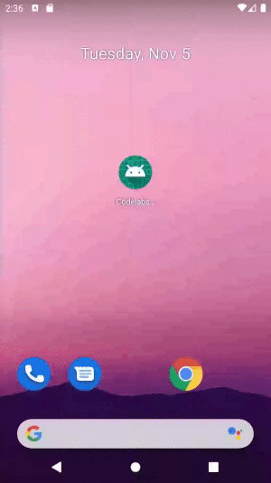

# Android fundamentals 01.2 PartA : Your first interactive UI - HelloToast

## Introduction

The HelloToast app consists of two Button elements and one TextView. When the user taps the first Button, it displays a short message (a Toast) on the screen. Tapping the second Button increases a "click" counter displayed in the TextView, which starts at zero.

## Task Completed

* Create an app and add two Button elements and a TextView to the layout.
* Manipulate each element in the ConstraintLayout to constrain them to the margins and other elements.
* Change UI element attributes.
* Edit the app's layout in XML.
* Extract hardcoded strings into string resources.
* Implement click-handler methods to display messages on the screen when the user taps each Button.

# Follow on [Twitter](https://twitter.com/amansharma_dev) :bird:

## Thank You. 
